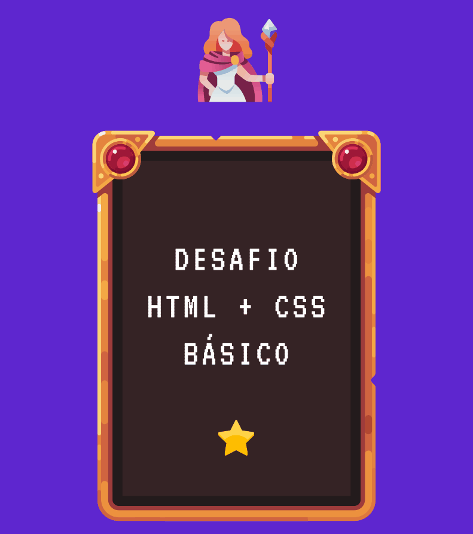
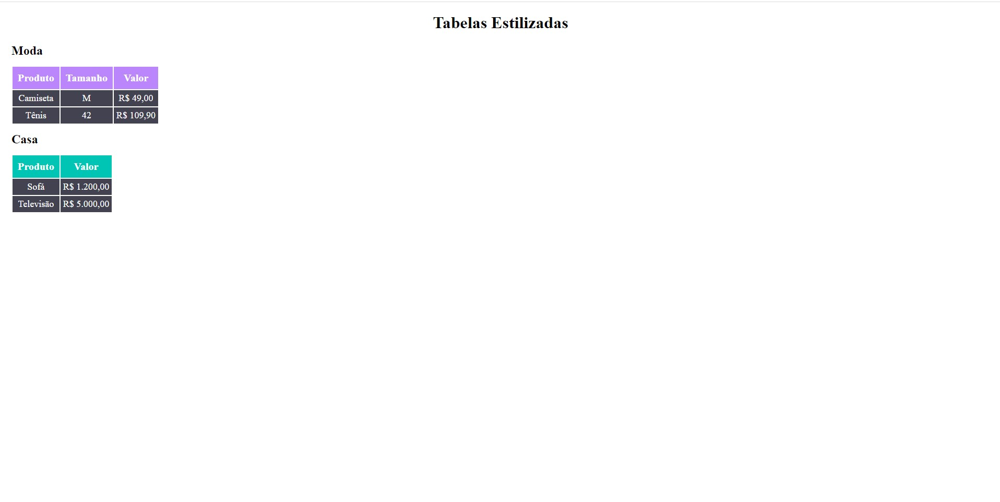

# Tabelas Estilizadas 
Um desafio de estilização de tabelas utilizando HTML e CSS;

## O Desafio 🦾

## Tecnologias utilizadas ⌨️

## Resultado 👌

## Desafios nessa jornada 👻

Um desafio ainda simples, HTML e CSS que já conhecia, mas pelo nível das aulas vejo que bem em breve estarei com projetos complexos. Não vejo a hora de estudar CSS avançado.
README.md criado no Visual Studio Code e todo o projeto upado via GIT Bash.

